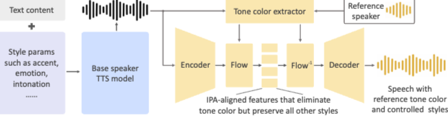

# Audio Comparison Repository: OpenVoice Experiments

This repository is dedicated to hosting and comparing audio samples generated using **OpenVoice**, an advanced text-to-speech (TTS) framework. The goal is to evaluate the performance of different TTS base models in combination with OpenVoice's tone and color converter.

---

## About OpenVoice

OpenVoice is a cutting-edge TTS framework that combines a **base TTS model** with a **tone and color converter** to generate high-quality, customizable speech.

- **Homepage**: [OpenVoice Official Website](https://research.myshell.ai/open-voice)
- **GitHub Repository**: [OpenVoice GitHub](https://github.com/myshell-ai/OpenVoice)
- **Architecture**:

  

---

## Base Models Overview

I selected the base models based on recommendations from the OpenVoice authors and the [Hugging Face TTS Arena](https://huggingface.co/spaces/Pendrokar/TTS-Spaces-Arena) .

Below are the TTS models used in this experiment:
### MeloTTS
- **Hugging Face Page**: [MeloTTS on Hugging Face](https://huggingface.co/myshell-ai/MeloTTS-English)
- **Github Page**: [MeloTTS Project](https://github.com/myshell-ai/MeloTTS)
- **Demo Page**: [Demo on Hugging Face](https://huggingface.co/spaces/mrfakename/MeloTTS)

### Zonos
- **Hugging Face Page**: [Zonos on Hugging Face](https://huggingface.co/Zyphra/Zonos-v0.1-hybrid)
- **Github Page**: [Zonos Project](https://github.com/Zyphra/Zonos/tree/main)
- **Demo Page**: [Demo on Hugging Face](https://huggingface.co/spaces/Steveeeeeeen/Zonos)

### Koroko
- **Hugging Face Page**: [Koroko on Hugging Face](https://huggingface.co/hexgrad/Kokoro-82M)
- **Github Page**: [Koroko Project](https://github.com/hexgrad/kokoro?tab=readme-ov-file)
- **Demo Page**: [Demo on Hugging Face](https://huggingface.co/spaces/hexgrad/Kokoro-TTS)

---

## Generated Samples

Below is a table summarizing the audio and video samples generated using the three base models (MeloTTS, Zonos, and Koroko). Each row corresponds to a specific input or scenario, and each column represents a base model.

## Generated Samples

Below is a table summarizing the audio and video samples generated using the three base models (MeloTTS, Zonos, and Koroko). Each row corresponds to a specific input or scenario, and each column represents a base model.

| **Sample Type**       |**Text/Reference Audio**                                                                 |  **MeloTTS**                                                                 | **Zonos**                                                                 | **Koroko**                                                               |
|------------------------|-----------------------------------------------------------------------------|-----------------------------------------------------------------------------|---------------------------------------------------------------------------|--------------------------------------------------------------------------|
| **Speaker 1: Base**   | "You know how greate Airdays is? WHile studying I sprayed Mist to wake up." | <audio controls><source src="./samples/melotts/sample1.wav" type="audio/wav">Audio</audio> | <audio controls><source src="./samples/zonos/sample1.wav" type="audio/wav">Audio</audio> | <audio controls><source src="./samples/koroko/sample1.wav" type="audio/wav">Audio</audio> |
| **Speaker 2: Base**   | "How is that... Possible!" | <audio controls><source src="./samples/melotts/sample2.wav" type="audio/wav">Audio</audio> | <audio controls><source src="./samples/zonos/sample2.wav" type="audio/wav">Audio</audio> | <audio controls><source src="./samples/koroko/sample2.wav" type="audio/wav">Audio</audio> |
| **Speaker 3 Base**   | "So thin, you forget you ar ewearing them. The K-F ninety-four Airdays. Anytime... Anywhere... The care of a mask. AirDays, K-F ninety-four... slimfit. " | <audio controls><source src="./samples/melotts/sample3.wav" type="audio/wav">Audio</audio> | <audio controls><source src="./samples/zonos/sample3.wav" type="audio/wav">Audio</audio> | <audio controls><source src="./samples/koroko/sample3.wav" type="audio/wav">Audio</audio> |
| **Speaker 1: Final**   | <audio controls><source src="./speaker1.mp3" type="audio/mp3">Audio</audio> | <audio controls><source src="./samples/melotts/sample5.wav" type="audio/wav">Audio</audio> | <audio controls><source src="./samples/zonos/sample5.wav" type="audio/wav">Audio</audio> | <audio controls><source src="./samples/koroko/sample5.wav" type="audio/wav">Audio</audio> |
| **Speaker 2: Final**   | <audio controls><source src="./speaker2.mp3" type="audio/mp3">Audio</audio> | <audio controls><source src="./samples/melotts/sample6.wav" type="audio/wav">Audio</audio> | <audio controls><source src="./samples/zonos/sample6.wav" type="audio/wav">Audio</audio> | <audio controls><source src="./samples/koroko/sample6.wav" type="audio/wav">Audio</audio> |
| **Speaker 3: Final**   | <audio controls><source src="./speaker3.mp3" type="audio/mp3">Audio</audio> | <audio controls><source src="./samples/melotts/sample7.wav" type="audio/wav">Audio</audio> | <audio controls><source src="./samples/zonos/sample7.wav" type="audio/wav">Audio</audio> | <audio controls><source src="./samples/koroko/sample8.wav" type="audio/wav">Audio</audio> |
| **Video Sample**       | [Watch Video](https://www.youtube.com/watch?v=OVXwIT84Xs4)     | [Watch Video](https://drive.google.com/uc?export=download&id=165CZGPXp7bUbTjY1nP0CG7iMEMO7roJ3)     | [Watch Video](https://drive.google.com/uc?export=download&id=FILE_ID_2)   | [Watch Video](https://drive.google.com/uc?export=download&id=1eqG-5O3rfRD1BZ1FXXiWf9P178d6d8d3) |
---

## How to Contribute

1. **Listen to Generated Audio and Final Video**  
2. **Compare Them Between Each Model**
3. **Comment on Their Shortcomings and Strengths**

---
